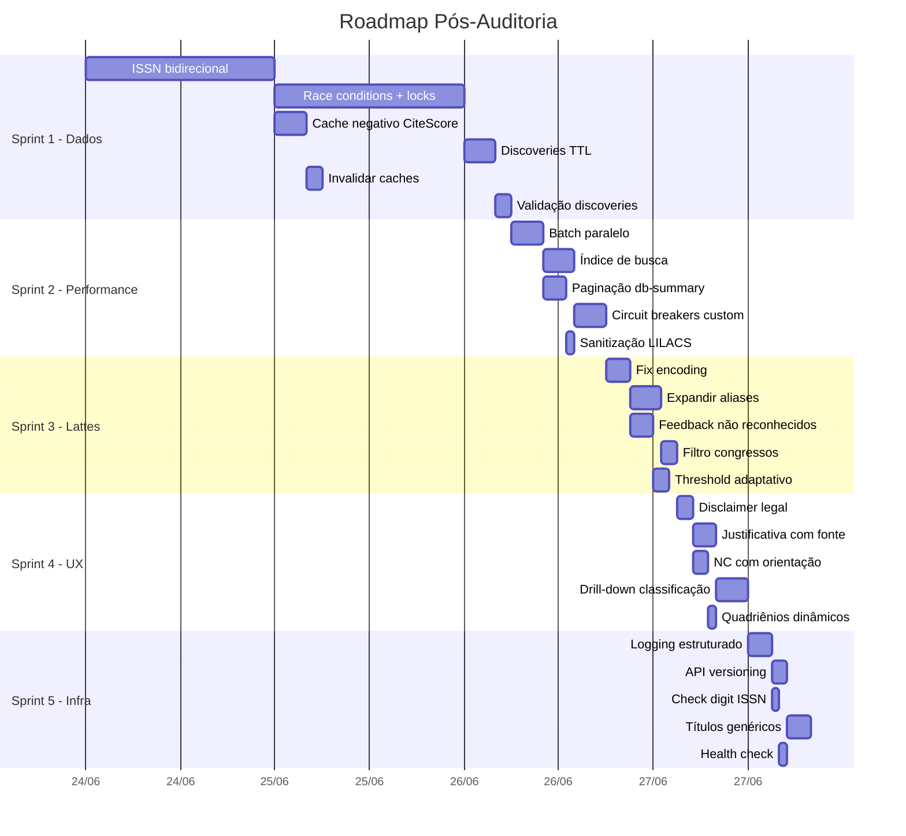

# 🗺️ Roadmap de Sprints — Melhorias Pós-Auditoria

> **Baseline**: Auditoria técnica de 22/06/2026  
> **Correções já aplicadas**: RC-8 (engine), S-1 (static files), S-2 (CORS), S-3 (rate limit), DB-3/UX-1 (timestamps)  
> **Nota**: O usuário removeu o disclaimer (UX-6) do HTML/CSS — re-listar abaixo.

---

## Status Geral

| Sprint | Tema | Itens | Esforço | Impacto |
|---|---|---|---|---|
| **Sprint 1** | Integridade de Dados | 6 itens | ~2-3 dias | 🔴 Crítico — Confiabilidade científica |
| **Sprint 2** | Performance & Resiliência | 5 itens | ~2 dias | 🟠 Alto — Escalabilidade |
| **Sprint 3** | Parser Lattes | 5 itens | ~2-3 dias | 🟠 Alto — Usabilidade e precisão |
| **Sprint 4** | UX & Transparência | 5 itens | ~1-2 dias | 🟠 Médio — Confiança institucional |
| **Sprint 5** | Infraestrutura & DevOps | 5 itens | ~1-2 dias | 🟡 Baixo — Manutenibilidade |

---

## Sprint 1 — Integridade de Dados & Confiabilidade

> **Objetivo**: Garantir que os dados são corretos, consistentes e não corrompidos por concorrência.  
> **Prioridade**: 🔴 Máxima — afeta diretamente a confiabilidade das classificações.

### 1.1 🔴 Mapeamento bidirecional ISSN ↔ e-ISSN `(F-1, RC-2, RC-10)`

**Problema**: Periódico com dois ISSNs (impresso + eletrônico) pode ter registros duplicados ou ser classificado como NC se o usuário usar o ISSN que não está na base.

**Como fazer**:

#### [compile_database.py](file:///c:/Dev/Qualis-capes/data/compile_database.py)
- Os CSVs do JCR já têm colunas `ISSN` e `EISSN`. O Scopus tem `Print-ISSN` e `E-ISSN`.
- Ao compilar, criar um campo `"alt_issn"` no registro do periódico com o ISSN alternativo.
- Construir um dicionário reverso `eissn_to_issn` que mapeia e-ISSN → ISSN primário.
- Ao encontrar um periódico com dois ISSNs, garantir que ambos apontem para o **mesmo registro** no `journals.json` (não duplicar).

#### [enricher.py](file:///c:/Dev/Qualis-capes/api/enricher.py)
- Na `load_database()`, após carregar o dicionário principal, gerar um `_eissn_index: dict[str, str]` que mapeia e-ISSN → ISSN primário.
- No lookup por ISSN, se não encontrar no dicionário principal, checar o `_eissn_index` e buscar pelo ISSN primário.

```python
# Exemplo de lookup com fallback
def find_journal(issn: str) -> dict | None:
    db = load_database()
    if issn in db:
        return db[issn]
    # Fallback: e-ISSN → ISSN primário
    primary = _eissn_index.get(issn)
    if primary and primary in db:
        return db[primary]
    return None
```

---

### 1.2 🟠 Race conditions na mutação de `_journals_db` e caches `(PA-3, C-2)`

**Problema**: Escrita simultânea no dicionário em memória e nos arquivos JSON de cache pode corromper dados.

**Como fazer**:

#### [cache.py](file:///c:/Dev/Qualis-capes/api/cache.py)
- Adicionar `asyncio.Lock()` para escrita em cada arquivo de cache:

```python
import asyncio

_cache_locks = {
    "scielo": asyncio.Lock(),
    "lilacs": asyncio.Lock(),
    "latindex": asyncio.Lock(),
    "discoveries": asyncio.Lock(),
}

async def save_json_cache_safe(name: str, data: dict):
    async with _cache_locks[name]:
        # atomic write: escreve em .tmp, depois rename
        tmp_path = f"{path}.tmp"
        with open(tmp_path, "w", encoding="utf-8") as f:
            json.dump(data, f, ensure_ascii=False)
        os.replace(tmp_path, path)  # atomic no mesmo filesystem
```

#### [enricher.py](file:///c:/Dev/Qualis-capes/api/enricher.py)
- Usar `threading.Lock()` para proteger mutações em `_journals_db` (ex: `_merge_indexer_result()`, `save_discovery()`).

---

### 1.3 🟠 Cache negativo persistente para CiteScore `(C-1)`

**Problema**: Quando a Elsevier retorna 404, o resultado "not found" só fica em memória. Após restart, a API é re-chamada para o mesmo ISSN.

**Como fazer**:

#### [enricher.py](file:///c:/Dev/Qualis-capes/api/enricher.py)
- Quando a Elsevier retorna 404, salvar no `citescore_cache.json` com `{"citeScore": null, "status": "not_found", "cached_at": "..."}`.
- No lookup, se o cache contiver `status: "not_found"` e `cached_at` < 30 dias → pular a chamada à API.

---

### 1.4 🟠 Discoveries sem TTL `(C-3)`

**Problema**: `runtime_discoveries.json` cresce indefinidamente e nunca revalida os dados.

**Como fazer**:

#### [cache.py](file:///c:/Dev/Qualis-capes/api/cache.py)
- Adicionar campo `discovered_at` em cada registro de discovery.
- Na `load_database()`, filtrar discoveries com mais de 90 dias (revalidar via APIs externas).
- Opcionalmente, limpar entries velhas automaticamente no startup.

---

### 1.5 🟠 Invalidar caches ao recompilar `journals.json` `(C-4)`

**Problema**: Se o operador recompila a base, caches antigos podem ter informações conflitantes.

**Como fazer**:

#### [compile_database.py](file:///c:/Dev/Qualis-capes/data/compile_database.py)
- Ao final da compilação, deletar `scielo_cache.json`, `lilacs_cache.json`, `latindex_cache.json` e `runtime_discoveries.json`.
- Exibir mensagem: `"Caches limpos. O servidor precisa ser reiniciado."`.

---

### 1.6 🟡 Validação de integridade no merge de discoveries `(DB-7)`

**Problema**: Discoveries podem conflitar com `journals.json` sem validação.

**Como fazer**:

#### [enricher.py](file:///c:/Dev/Qualis-capes/api/enricher.py)
- Ao mergear discoveries, se o ISSN já existe em `_journals_db`, fazer merge inteligente:
  - Adicionar indexadores que não existiam (sem sobrescrever os existentes).
  - Nunca sobrescrever JCR/CiteScore que já vieram da compilação.

---

## Sprint 2 — Performance & Resiliência

> **Objetivo**: Suportar uso simultâneo e melhorar tempos de resposta.  
> **Prioridade**: 🟠 Alta — necessário para uso em sala de aula / múltiplos coordenadores.

### 2.1 🔴 Batch endpoint com paralelismo server-side `(PA-1)`

**Problema**: O loop `for issn in request.issns` processa sequencialmente. 200 ISSNs = 200 chamadas sequenciais.

**Como fazer**:

#### [main.py](file:///c:/Dev/Qualis-capes/api/main.py) — endpoint `/api/classify/batch`
- Usar `asyncio.gather()` com concorrência limitada via `asyncio.Semaphore`:

```python
@app.post("/api/classify/batch")
async def api_classify_batch(body: BatchClassifyRequest, request: Request):
    semaphore = asyncio.Semaphore(10)  # máx 10 em paralelo

    async def classify_one(issn):
        async with semaphore:
            return await enricher.enrich_and_classify(issn, client)

    tasks = [classify_one(issn) for issn in body.issns]
    results = await asyncio.gather(*tasks)
    return {"results": results, "count": len(results)}
```

---

### 2.2 🟠 Índice de busca por título `(DB-1)`

**Problema**: `search_by_name()` faz O(n) scan em 35k+ registros, normalizando strings a cada chamada.

**Como fazer**:

#### [enricher.py](file:///c:/Dev/Qualis-capes/api/enricher.py)
- No `load_database()`, pré-computar um índice invertido `_title_index`:

```python
_title_index: dict[str, list[str]] = {}  # termo_normalizado → [issn1, issn2, ...]

def _build_title_index():
    for issn, record in _journals_db.items():
        title = _normalize(record.get("title", ""))
        for token in title.split():
            if len(token) >= 3:
                _title_index.setdefault(token, []).append(issn)
```

- No `search_by_name()`, buscar nos termos do índice em vez de varrer todos os registros.

---

### 2.3 🟠 Paginação + cache do `/api/db-summary` `(S-7)`

**Problema**: Retorna 35k+ registros (1-2 MB) em cada request, sem paginação.

**Como fazer**:

#### [main.py](file:///c:/Dev/Qualis-capes/api/main.py)
- Adicionar parâmetros `page` e `limit` (default limit=100):

```python
@app.get("/api/db-summary")
async def api_db_summary(page: int = 1, limit: int = 100, q: str = ""):
    items = enricher.get_db_summary()
    if q:
        items = [i for i in items if q.lower() in i["title"].lower()]
    start = (page - 1) * limit
    return {"total": len(items), "page": page, "items": items[start:start+limit]}
```

- Adicionar header `Cache-Control: max-age=300` na resposta.
- Atualizar o frontend (`enricher.js`) para buscar paginado ou usar o cache local.

---

### 2.4 🟠 Circuit breakers customizados por API `(CB-1, CB-2)`

**Problema**: Todas as APIs usam o mesmo threshold. Latindex (scraping) é muito mais instável que SciELO (REST).

**Como fazer**:

#### [cache.py](file:///c:/Dev/Qualis-capes/api/cache.py)
- Configurar thresholds por API:

| API | failure_threshold | window_seconds | cooldown_seconds |
|---|---|---|---|
| SciELO | 5 | 60 | 120 |
| LILACS | 5 | 60 | 120 |
| Latindex | 10 | 120 | 300 |
| Elsevier | 3 | 60 | 180 |

- Implementar exponential backoff no cooldown:

```python
def _get_cooldown(self):
    """Cooldown com backoff exponencial: 120s → 240s → 480s (máx 600s)."""
    base = self.cooldown_seconds
    factor = min(self._consecutive_opens, 3)
    return min(base * (2 ** factor), 600)
```

---

### 2.5 🟡 Sanitização do parâmetro `q` na busca LILACS `(S-9)`

**Problema**: O parâmetro `q` é concatenado na URL sem sanitização.

**Como fazer**:

#### [main.py](file:///c:/Dev/Qualis-capes/api/main.py) — `_fetch_lilacs_search()`
- Usar `httpx` params dict em vez de f-string:

```python
resp = await client.get(url_template, params={"q": q}, headers=headers, timeout=10)
```

---

## Sprint 3 — Parser Lattes

> **Objetivo**: Aumentar a taxa de reconhecimento de periódicos e dar feedback ao usuário.  
> **Prioridade**: 🟠 Alta — afeta diretamente a utilidade da feature Lattes.

### 3.1 🟠 Tratamento de encoding corrompido `(LP-3)`

**Problema**: Copiar/colar do Lattes frequentemente corrompe acentos (UTF-8 malformado).

**Como fazer**:

#### [lattesParser.js](file:///c:/Dev/Qualis-capes/js/lattesParser.js)
- Adicionar função `fixEncoding()` no início do pipeline, antes de qualquer parsing:

```javascript
function fixEncoding(text) {
  const replacements = {
    'é': 'é', 'ã': 'ã', 'á': 'á', 'í': 'í',
    'õ': 'õ', 'ó': 'ó', 'ú': 'ú', 'ç': 'ç',
    'â': 'â', 'ê': 'ê', 'ô': 'ô', 'Ã': 'à',
    'ü': 'ü', 'ñ': 'ñ',
    // Maiúsculas
    'É': 'É', 'Ç': 'Ç', 'Ã"': 'Ó', 'Ú': 'Ú',
  };
  let result = text;
  for (const [bad, good] of Object.entries(replacements)) {
    result = result.replaceAll(bad, good);
  }
  // Remover caracteres de controle e substituição
  result = result.replace(/[\u0000-\u001F\uFFFD□]/g, '');
  return result;
}
```

- Chamar `fixEncoding()` na primeira linha de `segmentLattesText()`.

---

### 3.2 🟠 Expandir LATTES_ALIASES `(F-4)`

**Problema**: Apenas 32 aliases hardcoded. Muitos periódicos de enfermagem têm abreviações comuns.

**Como fazer**:

#### [lattesParser.js](file:///c:/Dev/Qualis-capes/js/lattesParser.js)
- Expandir `LATTES_ALIASES` com ao menos mais ~50 entradas dos periódicos mais comuns em enfermagem. Fonte: extrair do `journals.json` os títulos mais frequentes e suas abreviações ISO 4.
- Considerar mover os aliases para um arquivo JSON externo (`data/aliases.json`) para facilitar manutenção.

---

### 3.3 🟠 Feedback visual de artigos não reconhecidos `(LP-4)`

**Problema**: Artigos que o parser não consegue resolver aparecem como NC silenciosamente.

**Como fazer**:

#### [app.js](file:///c:/Dev/Qualis-capes/js/app.js)
- No fluxo de processamento Lattes, separar os artigos em duas listas:
  - `matched`: periódicos com ISSN encontrado
  - `unmatched`: periódicos sem ISSN (matchedIssn === null)
- Após o processamento, exibir um toast ou banner:
  - `"⚠ X de Y artigos não foram reconhecidos. Verifique manualmente."`.
- Na tabela, destacar linhas não reconhecidas com ícone de alerta.

---

### 3.4 🟠 Filtro de anais de congresso `(LP — cenário real)`

**Problema**: Texto como "Anais do 15º Congresso..." é parseado como artigo e gera NC.

**Como fazer**:

#### [lattesParser.js](file:///c:/Dev/Qualis-capes/js/lattesParser.js)
- Adicionar filtro na `parseSingleArticle()`:

```javascript
const CONGRESS_KEYWORDS = [
  'anais', 'congresso', 'simposio', 'simpósio', 'encontro',
  'conference', 'proceedings', 'workshop', 'seminário', 'jornada'
];

function isCongressProceedings(text) {
  const lower = text.toLowerCase();
  return CONGRESS_KEYWORDS.some(kw => lower.includes(kw));
}
```

- Se detectar anais de congresso, marcar `article.type = 'congresso'` e não enviar para classificação.

---

### 3.5 🟡 Fuzzy match com threshold adaptativo `(F-3)`

**Problema**: Threshold fixo de 0.85 não funciona bem para títulos curtos e longos.

**Como fazer**:

#### [lattesParser.js](file:///c:/Dev/Qualis-capes/js/lattesParser.js) — `matchJournalToISSN()`
- Ajustar threshold baseado no comprimento do título:

```javascript
function getAdaptiveThreshold(titleLength) {
  if (titleLength <= 10) return 0.92;  // Títulos curtos: exigir mais
  if (titleLength <= 25) return 0.88;
  return 0.85;  // Títulos longos: manter atual
}
```

---

## Sprint 4 — UX & Transparência

> **Objetivo**: Aumentar a confiança do usuário nos resultados.  
> **Prioridade**: 🟠 Média — necessário para uso institucional.

### 4.1 🔴 Re-implementar disclaimer legal `(UX-6)`

**Problema**: O disclaimer foi removido do HTML e CSS. Essencial para uso institucional.

**Como fazer**:

- Decidir o posicionamento ideal (footer fixo, banner no topo, ou dentro do empty state).
- Texto mínimo sugerido: *"Ferramenta auxiliar. Classificações estimadas com base em dados públicos. Não substitui a avaliação oficial da CAPES/Sucupira."*
- Manter visível em todas as telas (não apenas no empty state).

---

### 4.2 🟠 Justificativa com fonte e ano `(UX-2)`

**Problema**: A justificativa diz "JCR = 1.50" mas não informa de qual ano/fonte.

**Como fazer**:

#### [engine.py](file:///c:/Dev/Qualis-capes/api/engine.py)
- Incluir `"(Base local)"` ou `"(API Elsevier)"` na justificação.

#### [enricher.py](file:///c:/Dev/Qualis-capes/api/enricher.py)
- Propagar a origem dos dados no registro:
  - `"jcr_source": "JCR 2024 (local)"` ou `"citescore_source": "Elsevier API (runtime)"`

#### Frontend
- Exibir a fonte junto à justificativa na tabela:
  - `"CiteScore = 2.30 (entre 1.8 e 2.9) — Fonte: Elsevier API"`

---

### 4.3 🟠 NC com orientação ao usuário `(UX-3)`

**Problema**: Quando o estrato é NC, o usuário não sabe o que fazer.

**Como fazer**:

#### [table.js](file:///c:/Dev/Qualis-capes/js/table.js) — célula de justificativa
- Quando `estrato === "NC"`, adicionar texto de orientação:

```
"Periódico não classificado. Sugestões:
• Verifique o ISSN (impresso vs. eletrônico)
• Tente buscar pelo nome completo
• O periódico pode não estar indexado em nenhuma base CAPES"
```

---

### 4.4 🟡 Drill-down na classificação `(UX-4)`

**Problema**: O usuário não entende por que não obteve estrato maior.

**Como fazer**:

#### [engine.py](file:///c:/Dev/Qualis-capes/api/engine.py)
- Além do `estrato` e `justification`, retornar um campo `all_candidates`:

```python
return {
    "estrato": "A2",
    "justification": "CiteScore = 2.30 (entre 1.8 e 2.9)",
    "all_candidates": [
        {"estrato": "A2", "reason": "CiteScore = 2.30 (entre 1.8 e 2.9)"},
        {"estrato": "A3", "reason": "MEDLINE indexado"},
        {"estrato": "A4", "reason": "SCIELO indexado"},
    ]
}
```

#### Frontend
- Adicionar botão "Ver detalhes" na célula de justificativa que expande a lista `all_candidates`, mostrando todos os critérios avaliados e qual foi o melhor.

---

### 4.5 🟡 Quadriênios dinâmicos `(UX-7)`

**Problema**: Os filtros de quadriênio estão hardcoded no HTML.

**Como fazer**:

#### [app.js](file:///c:/Dev/Qualis-capes/js/app.js) ou [ui.js](file:///c:/Dev/Qualis-capes/js/ui.js)
- Gerar os quadriênios dinamicamente baseado no ano atual:

```javascript
function generateQuadrienios() {
  const currentYear = new Date().getFullYear();
  const periods = [];
  // Quadriênios começam em 2013, 2017, 2021, 2025...
  for (let start = 2013; start <= currentYear + 4; start += 4) {
    periods.push(`${start}-${start + 3}`);
  }
  return periods;
}
```

---

## Sprint 5 — Infraestrutura & DevOps

> **Objetivo**: Facilitar manutenção, monitoramento e evolução.  
> **Prioridade**: 🟡 Baixa — qualidade de vida do desenvolvedor.

### 5.1 🟡 Logging estruturado `(CB-3)`

**Como fazer**:

#### Todos os módulos Python
- Substituir `print()` por `logging.getLogger(__name__)`.
- Configurar formato com timestamp:

```python
import logging
logging.basicConfig(
    level=logging.INFO,
    format="%(asctime)s [%(name)s] %(levelname)s: %(message)s",
    datefmt="%Y-%m-%d %H:%M:%S",
)
```

- Logar aberturas/fechamentos de circuit breakers com `WARNING`.

---

### 5.2 🟡 API versioning `(PA-4)`

**Como fazer**:

#### [main.py](file:///c:/Dev/Qualis-capes/api/main.py)
- Criar `APIRouter(prefix="/api/v1")` e mover todas as rotas para ele.
- Manter `/api/*` como alias temporário (deprecated) com redirect.

---

### 5.3 🟡 Validação de check digit do ISSN `(F-5)`

**Como fazer**:

#### [enricher.py](file:///c:/Dev/Qualis-capes/api/enricher.py) — `normalize_issn()`
- Adicionar validação módulo 11:

```python
def validate_issn_checkdigit(issn: str) -> bool:
    digits = issn.replace("-", "")
    if len(digits) != 8:
        return False
    total = sum(int(d) * (8 - i) for i, d in enumerate(digits[:7]))
    check = 11 - (total % 11)
    expected = 'X' if check == 10 else ('0' if check == 11 else str(check))
    return digits[7].upper() == expected
```

---

### 5.4 🟡 Títulos genéricos na base `(DB-4)`

**Como fazer**:

#### [compile_database.py](file:///c:/Dev/Qualis-capes/data/compile_database.py)
- Ao criar periódicos não encontrados no Sucupira, tentar buscar o título no JCR CSV ou Scopus XLSX em vez de usar "Periódico do JCR".
- Prioridade: Título do Sucupira > Título do Scopus > Título do JCR > Genérico.

---

### 5.5 🟡 Health check endpoint `(novo)`

**Como fazer**:

#### [main.py](file:///c:/Dev/Qualis-capes/api/main.py)
- Criar endpoint `/api/health` (leve, sem autenticação):

```python
@app.get("/api/health")
async def health():
    db = enricher.load_database()
    meta = enricher.get_database_meta()
    return {
        "status": "healthy" if len(db) > 0 else "degraded",
        "db_loaded": len(db) > 0,
        "db_size": len(db),
        "compiled_at": meta.get("compiled_at") if meta else None,
    }
```

---

## Sequência Recomendada



---

## Critérios de Aceitação por Sprint

| Sprint | Critério de "Done" |
|---|---|
| **1** | Testes unitários para lookup bidirecional de ISSN. Nenhum race condition reproduzível com 10 requests simultâneos. |
| **2** | Batch de 100 ISSNs completa em < 30s (vs minutos anterior). `db-summary` com paginação validada. |
| **3** | Parser Lattes reconhece ≥ 90% dos artigos de um currículo real. Feedback visual para NCs. |
| **4** | Disclaimer visível em todas as telas. Justificativa inclui fonte e ano. NC tem orientação. |
| **5** | Logs estruturados com timestamps. Health check retorna status correto. |
