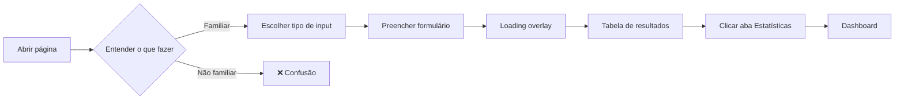

# Auditoria de UI/UX — Classificador Qualis CAPES

> **Perfil do Avaliador:** Especialista Sênior em UX/UI com foco em dashboards analíticos, sistemas acadêmicos e produtos SaaS científicos.  
> **Data da Análise:** 14 de Junho de 2026  
> **Versão Analisada:** Interface web (HTML/CSS/JS vanilla + Chart.js)

---

## Sumário Executivo

O sistema apresenta uma **fundação visual premium** com glassmorphism bem executado, tipografia elegante e design system consistente. Porém, a análise revela **problemas estruturais de UX** que impactam diretamente a experiência do público acadêmico: a hierarquia de informação está invertida em momentos-chave, o fluxo de onboarding é implícito, e o dashboard carece de métricas acionáveis que realmente guiem decisões de um coordenador de PPG.

**Nota geral: 7.2/10** — Visualmente impressionante, funcionalmente competente, mas com lacunas de UX que impedem o salto para um produto de referência.

---

## 1. Hierarquia Visual

### O que funciona ✅
- **KPI cards** com gradiente no valor numérico criam foco imediato
- **Badges de estrato** com cores de medalha (ouro A1, prata A2, bronze A3) são intuitivos
- **Glassmorphism** nos cards e sidebar cria profundidade sem ruído visual
- **Tipografia** Outfit (títulos) + Inter (corpo) é uma combinação excelente para dashboards

### Problemas Identificados ❌

#### P1 — Empty state não orienta, apenas espera
O estado vazio mostra apenas "Aguardando Dados para Análise" com um ícone flutuante. Para um coordenador de PPG abrindo a ferramenta pela primeira vez, não há **nenhum guia de uso**. Plataformas como SciVal e InCites sempre oferecem um tutorial inline ou wizard de onboarding.

> [!WARNING]
> **Impacto:** Um professor com pouca familiaridade digital pode não entender o que fazer e abandonar a ferramenta.

#### P2 — Sidebar compete com o conteúdo principal
A sidebar ocupa 320px fixos com 4 formulários empilhados, card de histórico e badge de status. Em telas de 1366px (notebooks comuns em universidades), isso deixa apenas ~700px para o dashboard — insuficiente para 2 gráficos lado a lado.

#### P3 — Aba "Estatísticas" é secundária quando deveria ser primária
Para o caso de uso de **análise de currículo Lattes**, o dashboard é o produto final. No entanto, ele está atrás de um clique na aba "Estatísticas & Dashboard", enquanto a "Tabela Detalhada" é a aba padrão. Isso inverte a hierarquia para o principal caso de uso.

#### P4 — Header gasta espaço vertical precioso
O logo com 80px de altura + subtitle + botão de tema consome ~120px de espaço vertical que poderia ser ocupado pelo conteúdo. Em dashboards analíticos (Tableau, Power BI), o header é slim (40-50px) ou colapsável.

---

## 2. Fluxo de Uso

### Mapeamento dos Fluxos Atuais

### Problemas Identificados ❌

#### P5 — Falta de onboarding para primeiro uso
Nenhum walkthrough, tooltip de orientação ou numbered steps. Comparar com Dimensions.ai que mostra "Start by searching for a researcher or pasting DOIs" como placeholder contextual.

#### P6 — Input "Currículo" exige conhecimento prévio
O campo "Cole a lista de artigos do Lattes" assume que o usuário sabe **exatamente qual seção** do Lattes copiar e em qual formato. Falta:
- Instrução visual de como copiar do Lattes
- Validação em tempo real do texto colado
- Preview do que será processado antes de submeter

#### P7 — Ausência de feedback progressivo no processamento em lote
Ao processar 20+ artigos de um currículo, o overlay de loading mostra uma mensagem estática. Não há barra de progresso, contador de artigos processados, ou indicação de "artigo 7/23 processado". O usuário fica cego sobre o progresso.

#### P8 — Fluxo pós-classificação não tem call-to-action claro
Após classificar, o sistema vai para a tabela. Faltam ações contextuais evidentes:
- "Exportar Relatório"
- "Ver Dashboard Resumido"
- "Comparar com Outro Currículo"

---

## 3. Dashboard e Métricas

### Avaliação dos KPIs Atuais

| KPI | Relevância | Problema |
|-----|-----------|----------|
| **Total de Artigos** | ⭐⭐ Baixa | Informação óbvia — o usuário sabe quantos artigos inseriu |
| **Produção Qualificada (A1+A2)** | ⭐⭐⭐⭐⭐ Alta | Excelente — métrica central para avaliação CAPES |
| **Qualidade do Currículo (Score)** | ⭐⭐⭐⭐ Alta | Boa, mas o score 0-100 é arbitrário e sem referência comparativa |
| **Não Classificados (NC)** | ⭐⭐⭐ Média | Útil para diagnóstico, mas poderia ser indicador de atenção, não KPI |
| **Cobertura Internacional** | ⭐⭐⭐⭐ Alta | Relevante, mas a definição (Scopus + WoS + Medline) deveria ser visível |

### KPIs que FALTAM (e que coordenadores realmente precisam) ❌

#### P9 — Falta: Distribuição por Cenário (Enfermagem vs Outras Áreas)
A regra de classificação muda completamente entre Enfermagem e Outras Áreas. Um KPI mostrando "X% classificados como Enfermagem" é fundamental.

#### P10 — Falta: Índice de Produtividade por Período
Coordenadores de PPG precisam ver a produção no **quadriênio avaliativo** (2021-2024, por exemplo). Um filtro temporal ou destaque do quadriênio ativo seria altamente valioso.

#### P11 — Falta: Mediana do estrato (além da média)
A média é distorcida por outliers (um A1 com vários NCs). A **mediana** daria uma visão mais realista.

#### P12 — O Score 0-100 é opaco
O score "65/100" não significa nada para um professor. Seria mais útil mostrar algo como "Seu perfil é equivalente a um programa Nota 5 na CAPES" ou usar uma escala de 3-7 alinhada às notas de PPGs.

### Avaliação dos Gráficos

| Gráfico | Tipo | Avaliação |
|---------|------|-----------|
| **Distribuição Qualis** | Doughnut | ✅ Adequado — boa escolha para proporções de categorias |
| **Indexadores** | Barras horizontais | ✅ Adequado — boa legibilidade para nomes longos |
| **Produção por Ano** | Barras verticais | ⚠️ Ok, mas seria melhor como **área empilhada** por estrato |
| **Evolução da Qualidade** | Linha | ⚠️ Limitado — linha simples perde a distribuição por estrato ao longo do tempo |

#### P13 — Gráfico de Produção por Ano é superficial
Mostra apenas volume, não qualidade. Um **stacked bar** (empilhado) colorido por estrato mostraria se a produção está *crescendo em volume mas caindo em qualidade*, o que é uma informação crítica para coordenadores.

#### P14 — Gráfico de Evolução mostra score médio sem contexto
O score 0-100 por ano, sem bandas de referência (ex: zona A1-A2 em verde, zona NC em vermelho) é difícil de interpretar.

---

## 4. Formulários e Entrada de Dados

### Avaliação por Tipo de Input

#### Input Individual — ⭐⭐⭐⭐ Bom
- ✅ Aceita ISSN e nome — busca híbrida inteligente
- ✅ Modal de seleção quando há múltiplos resultados
- ⚠️ Placeholder muito longo ("Ex: 0104-1169 ou Revista Latino-Americana de Enfermagem") — trunca em telas menores
- ❌ Falta máscara de input para ISSN (XXXX-XXXX)

#### Input em Lote — ⭐⭐⭐ Ok
- ✅ Aceita vários delimitadores (newline, vírgula, ponto-e-vírgula)
- ❌ Falta contador de ISSNs detectados ("12 ISSNs encontrados")
- ❌ Falta validação visual inline de formato

#### Upload CSV — ⭐⭐⭐ Ok
- ✅ Drag & drop funcional com feedback visual
- ❌ Falta preview do conteúdo antes de processar
- ❌ Falta suporte a Excel (.xlsx), formato muito mais comum na academia

#### Currículo Lattes — ⭐⭐ Fraco (crítico)

> [!CAUTION]
> Este é o **fluxo mais importante** do sistema e é o que mais precisa de melhorias.

#### P15 — Falta instrução visual de como copiar do Lattes
O usuário precisa ir ao Lattes, encontrar a seção "Artigos completos publicados em periódicos", selecionar todo o texto e colar. Um **step-by-step visual** com screenshots seria transformador.

#### P16 — Falta validação e preview do texto colado
Ao colar 50 linhas de texto, o usuário não sabe se o parser reconheceu 10 ou 40 artigos até processar tudo. Um preview tipo "Encontramos 23 artigos neste texto. Confirmar processamento?" reduziria erros.

#### P17 — Campo de nome do pesquisador é redundante
O nome poderia ser extraído automaticamente do texto do Lattes ou ser opcional.

---

## 5. Visualização dos Resultados

### Tabela Detalhada

#### Problemas de Legibilidade

#### P18 — Tabela com 7 colunas é larga demais para o espaço disponível
Com sidebar de 320px, a área útil é ~880px. Sete colunas com padding resultam em texto truncado e scroll horizontal.

#### P19 — Coluna "Área Encontrada" ocupa espaço com informação de baixa variação
Na maioria dos currículos, quase todos os artigos serão "Enfermagem". Uma coluna inteira para mostrar "Enfermagem" repetidamente é desperdício de espaço.

#### P20 — JCR e CiteScore nulos mostram ícone de "?" mas sem tooltip claro
O ícone de help-circle com tooltip "Métrica JCR não disponível" é correto, mas o traço "-" com ícone minúsculo é difícil de perceber. Uma abordagem melhor seria usar "N/A" com cor muted, sem ícone.

### Insights & Destaques

#### P21 — Insights são genéricos e repetitivos
Os 4 insights seguem o mesmo padrão: "X% está em Y. Isso é bom/ruim." Faltam insights **acionáveis**:
- "3 artigos poderiam subir de A4 para A3 se publicados em revistas indexadas no Medline"
- "Seu principal periódico (RLAE) contribui com 40% do score — risco de concentração"

---

## 6. Design System

### Consistência Visual — ⭐⭐⭐⭐ Boa

| Aspecto | Status | Detalhe |
|---------|--------|---------|
| **CSS Variables** | ✅ | 30+ variáveis cobrindo cores, tipografia, espaçamento |
| **Tipografia** | ✅ | Hierarquia clara: Outfit 700 (títulos) → Inter 400 (corpo) |
| **Espaçamento** | ⚠️ | Usa valores mistos (20px, 30px, 40px) sem escala consistente (4/8/12/16/24/32/48) |
| **Border radius** | ✅ | Consistente via `--radius: 16px` |
| **Sombras** | ✅ | Design token `--shadow` reutilizado |
| **Transições** | ✅ | Curva cubic-bezier consistente via `--transition` |

### Problemas do Design System

#### P22 — Espaçamento não segue escala consistente
O CSS alterna entre `12px`, `15px`, `20px`, `24px`, `30px` sem lógica de escala. Dashboards profissionais usam escala de 8pt (`8, 16, 24, 32, 40, 48`).

#### P23 — `prefers-reduced-motion` não é respeitado
Há animações contínuas (`float`, `pulse`, `spin`) que não são desabilitadas para usuários que preferem movimento reduzido. Isto é um problema de **acessibilidade WCAG**.

#### P24 — Contraste em light mode pode ser insuficiente
O `--text-secondary` em light mode é `#475569` (slate-600). Para textos pequenos (11-12px como subtítulos dos KPIs), o contraste com fundo branco pode ficar abaixo de 4.5:1 — o mínimo WCAG AA para texto normal.

#### P25 — Botões de submit não desabilitam durante processamento
O formulário não desabilita o botão "Classificar Periódico" durante o loading, permitindo múltiplos submits acidentais. A UX best practice é `disabled={loading}` + spinner no botão.

---

## 7. Experiência do Usuário Acadêmico

### Perfis de Usuário e Adequação

| Perfil | Adequação | Justificativa |
|--------|-----------|---------------|
| **Coordenador de PPG** | ⭐⭐⭐ | Faltam métricas de quadriênio, comparativo, e relatório exportável formatado |
| **Professor/Pesquisador** | ⭐⭐⭐⭐ | Funcional para verificar classificação de artigos individuais |
| **Aluno de Mestrado/Doutorado** | ⭐⭐⭐⭐ | Interface intuitiva o suficiente, mas falta onboarding |
| **Secretaria acadêmica** | ⭐⭐ | Falta processamento em massa e relatório institucional |

### Problemas Específicos do Público Acadêmico

#### P26 — Falta exportação de relatório formatado
A exportação atual é CSV puro. Coordenadores precisam de **relatório com layout** (PDF/Word) para inserir em documentos da CAPES. Um PDF com cabeçalho institucional, KPIs resumidos e tabela formatada seria altamente valioso.

#### P27 — Falta modo comparativo
A CAPES avalia programas comparativamente. A capacidade de carregar 2-3 currículos e compará-los lado a lado (radar chart com métricas de cada pesquisador) seria um diferencial competitivo enorme.

#### P28 — Terminologia inconsistente com a CAPES
O sistema usa "Score do Currículo" e "Qualidade do Currículo" — termos inventados. A CAPES usa "Produção Intelectual", "Indicadores de Produção" e "Estrato". Alinhar a terminologia aumentaria a confiança do usuário.

---

## 8. Benchmark Comparativo

| Critério | Qualis CAPES | Scopus | SciVal | InCites | Dimensions | Power BI |
|----------|:---:|:---:|:---:|:---:|:---:|:---:|
| **Onboarding** | ❌ | ✅ | ✅ | ✅ | ✅ | ✅ |
| **Filtro temporal** | ❌ | ✅ | ✅ | ✅ | ✅ | ✅ |
| **Comparativo** | ❌ | ✅ | ✅ | ✅ | ⚠️ | ✅ |
| **Relatório PDF** | ❌ | ✅ | ✅ | ✅ | ❌ | ✅ |
| **Design visual** | ✅ | ⚠️ | ⚠️ | ⚠️ | ✅ | ✅ |
| **Métricas acionáveis** | ⚠️ | ✅ | ✅ | ✅ | ✅ | N/A |
| **Velocidade** | ✅ | ⚠️ | ⚠️ | ⚠️ | ✅ | ✅ |
| **Custo** | ✅ Grátis | $$$ | $$$ | $$$ | $ | $$ |

> O sistema tem uma vantagem competitiva clara: é **gratuito, rápido e específico para Enfermagem**. Mas precisa adicionar funcionalidades de análise que plataformas pagas oferecem.

---

## 9. Priorização de Melhorias

### 🟢 Alto Impacto / Baixo Esforço

| # | Melhoria | Problema | Esforço | Impacto |
|---|----------|----------|---------|---------|
| M1 | Aba Estatísticas como padrão no fluxo Lattes | P3 | 2 min | ⭐⭐⭐⭐⭐ |
| M2 | Barra de progresso no processamento em lote | P7 | 1h | ⭐⭐⭐⭐⭐ |
| M3 | Desabilitar botão submit durante loading | P25 | 15 min | ⭐⭐⭐⭐ |
| M4 | `prefers-reduced-motion` no CSS | P23 | 15 min | ⭐⭐⭐⭐ |
| M5 | Escala de espaçamento 8pt | P22 | 30 min | ⭐⭐⭐ |
| M6 | Preview de artigos detectados antes de processar (Lattes) | P16 | 1h | ⭐⭐⭐⭐⭐ |
| M7 | KPI de distribuição Enfermagem vs Outras Áreas | P9 | 30 min | ⭐⭐⭐⭐ |
| M8 | Remover coluna "Área Encontrada" da tabela; mover para tooltip | P19 | 20 min | ⭐⭐⭐ |

### 🟡 Alto Impacto / Médio Esforço

| # | Melhoria | Problema | Esforço | Impacto |
|---|----------|----------|---------|---------|
| M9 | Empty state com step-by-step de onboarding | P1, P5 | 2-3h | ⭐⭐⭐⭐⭐ |
| M10 | Gráfico stacked bar (volume por ano + estrato) | P13 | 2h | ⭐⭐⭐⭐ |
| M11 | Bandas de referência no gráfico de evolução | P14 | 1.5h | ⭐⭐⭐⭐ |
| M12 | Filtro temporal (quadriênio CAPES) | P10 | 3h | ⭐⭐⭐⭐⭐ |
| M13 | Header compacto / colapsável | P4 | 2h | ⭐⭐⭐ |
| M14 | Instrução visual de como copiar do Lattes | P15 | 2h | ⭐⭐⭐⭐⭐ |
| M15 | Insights acionáveis ("seus artigos poderiam...") | P21 | 4h | ⭐⭐⭐⭐ |
| M16 | Alinhar terminologia com vocabulário CAPES oficial | P28 | 1h | ⭐⭐⭐⭐ |

### 🔴 Alto Impacto / Alto Esforço

| # | Melhoria | Problema | Esforço | Impacto |
|---|----------|----------|---------|---------|
| M17 | Exportação de relatório em PDF formatado | P26 | 8-12h | ⭐⭐⭐⭐⭐ |
| M18 | Modo comparativo de múltiplos currículos | P27 | 16-24h | ⭐⭐⭐⭐⭐ |
| M19 | Suporte a upload Excel (.xlsx) | P15 | 4-6h | ⭐⭐⭐ |
| M20 | Escala de score alinhada às notas CAPES (3-7) | P12 | 4h | ⭐⭐⭐⭐ |

---

## 10. Ordem Recomendada de Implementação

### Sprint 1 — Quick Wins (1-2 dias)
> Foco: Corrigir problemas que geram atrito imediato

1. **M1** — Aba Estatísticas como padrão no fluxo Lattes
2. **M3** — Desabilitar botão submit durante loading
3. **M4** — `prefers-reduced-motion`
4. **M8** — Remover coluna "Área" da tabela → tooltip
5. **M7** — KPI: Enfermagem vs Outras Áreas
6. **M5** — Escala de espaçamento 8pt

### Sprint 2 — Experiência de Entrada (3-5 dias)
> Foco: Tornar o fluxo Lattes excelente

7. **M6** — Preview de artigos detectados antes de processar
8. **M14** — Instrução visual de como copiar do Lattes
9. **M2** — Barra de progresso no processamento em lote
10. **M9** — Empty state com onboarding

### Sprint 3 — Dashboard Avançado (1 semana)
> Foco: Métricas que realmente ajudam coordenadores

11. **M12** — Filtro temporal (quadriênio)
12. **M10** — Stacked bar de produção por ano
13. **M11** — Bandas de referência no gráfico de evolução
14. **M15** — Insights acionáveis
15. **M16** — Terminologia CAPES

### Sprint 4 — Funcionalidades Diferenciadoras (2 semanas)
> Foco: Funcionalidades que nenhum concorrente gratuito oferece

16. **M17** — Relatório PDF
17. **M20** — Escala de score CAPES
18. **M13** — Header compacto
19. **M18** — Modo comparativo
20. **M19** — Suporte Excel

---

## Pontos Fortes Finais

1. ✅ **Design visual premium** — glassmorphism, tipografia, paleta de cores são superiores à maioria das ferramentas acadêmicas
2. ✅ **Performance** — processamento rápido, sem delays perceptíveis na UI
3. ✅ **Busca híbrida** — aceitar ISSN e nome é inteligente e inclusivo
4. ✅ **Persistência de sessão** — sessionStorage mantém dados entre recarregamentos
5. ✅ **Tema dual** — suporte a dark/light mode bem implementado
6. ✅ **Toast notifications** — feedback não-bloqueante com design premium
7. ✅ **Custo zero** — vantagem competitiva contra SciVal ($$$) e InCites ($$$)
